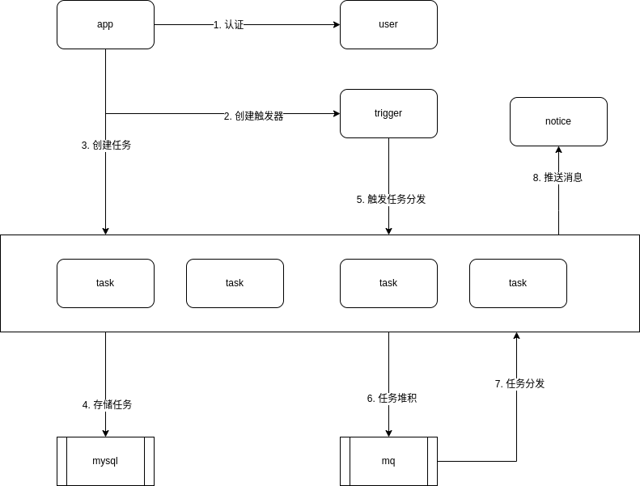

# 项目介绍

自动签到程序, 纯属娱乐.

# 功能

定时执行一些任务, 支持的任务定义在 [task.proto](./internal/proto/task/task.proto)

# 部署

## 依赖环境

- MySQL
  - 存储任务
  - 所需表在 [sign.sql](./deployments/sql)
- RabbitMQ
  - 任务分发
- Etcd (k8s 的)
  - 注册中心

## 配置文件

模板在 [conf.yaml.default](./configs/conf.yaml.default)

## 编译

```shell
$ make all
```

可执行文件默认输出到 `_output/build/`.

## 启动

```shell
$ ./xxx.out --config conf.yaml
```

# Kubernetes 部署

k8s 部署配置模板在 [deployments](./deployments) 中.

1. 创建 Secret

- 这里把配置及连接 etcd 所需的证书都放到 config 目录中, 并创建 Secret

```shell
$ kubectl create secret generic sign-config --from-file=config/
```

2. 创建 Deployment

```shell
$ kubectl create -f deployment.yaml
```

# 创建任务

## 使用 signctl

1. 构建 signctl

signctl 生成在 `./_ooutput/tools/`.

```shell
$ make ctl
```

2. 创建用户

创建用户后会返回 `token`, 之后任何操作使用 `-T token` 方式.

```shell
$ ./signctl.out create user -H server_address --nickname xxx
```

3. 创建 secret

创建 secret 后会返回 secretID.

```shell
$ ./signctl.out create secret -H server_address -T token --domain 101 --key xxx
```

4. 创建 task

`--secret-id` 用于指定要使用的 secret.

```shell
$ ./signctl.out create task -H server_address -T token --kind 102 --secret-id xxx --spec "0 8 * * *"
```

# 各组件介绍

## app

类似网关, signctl 与其交互来对各资源进行操作.

## task

管理任务对象, 创建任务, 同时负责执行任务, 应该多实例部署.

## notice

类似消息推送, 目前使用 telegram bot 做消息接收.

## trigger

触发器, 时间到时将任务发到 RabbitMQ, 再由 executor 执行.

## user

用户管理.

## signctl
 
一个简单的命令行工具, 用于创建任务.

# 程序架构

